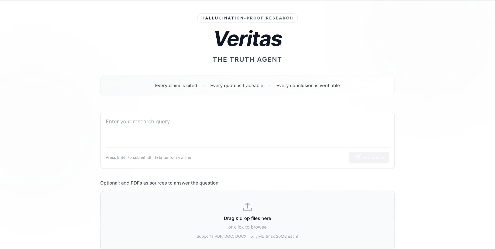
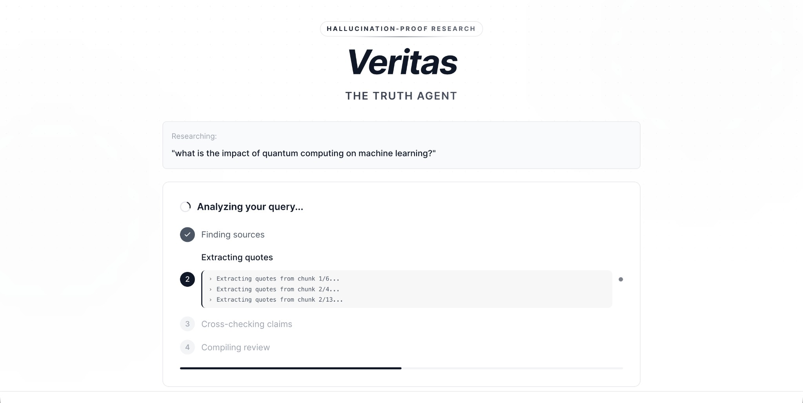
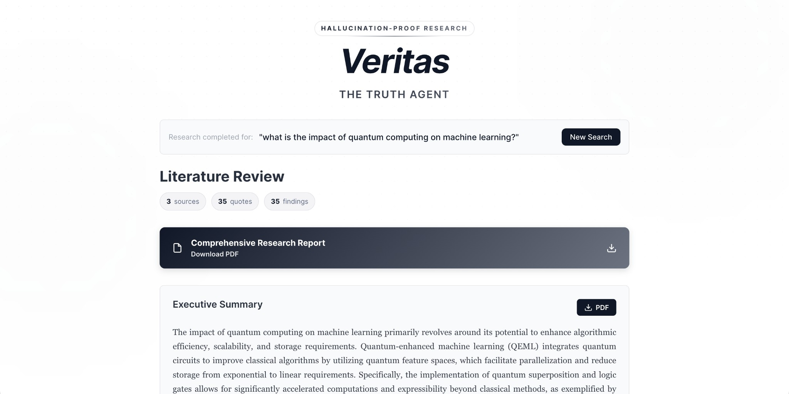
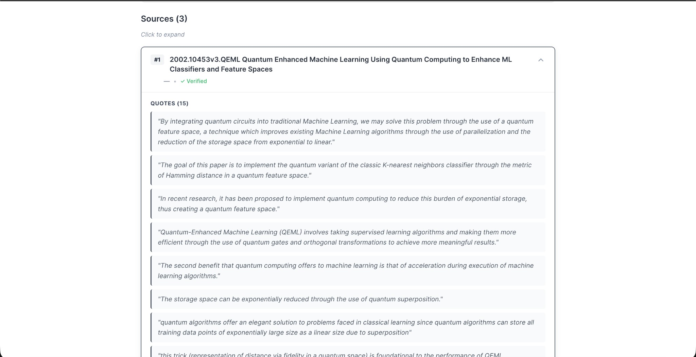

# Veritas — Hallucination-proof research

Frontend (React + Vite) and backend (Python research pipeline) for literature review with **traceable quotes**: every claim is cited, every quote is verified against the source PDF, and every conclusion is verifiable.

---

## App Workflow

### 1. Initial input

Enter your research question in the text area and optionally add PDFs by dragging and dropping or clicking to browse. Trust badges remind you that every claim is cited, every quote is traceable, and every conclusion is verifiable. Press Enter to submit or Shift+Enter for a new line.



### 2. Processing

While the pipeline runs, a step-by-step progress view shows where you are: finding sources → extracting quotes → cross-checking claims → compiling review. The active step shows live sub-tasks (e.g. which chunk is being analyzed), and a progress bar reflects overall completion.



### 3. Written results

After the run completes, the Literature Review section shows counts for sources, quotes, and findings. You can download the **Comprehensive Research Report** (full literature review) or the **Executive Summary** as PDF. The summary gives a concise, evidence-based overview of the research question.



### 4. Sources

Each source appears as an expandable card. Expand one to see its title, verification status, and all extracted quotes. Every quote is verbatim from the paper and traceable to the source, so you can verify claims yourself.



---

## Architecture overview

| Layer | Role |
|-------|------|
| **Frontend** (`tartan_frontend/`) | React app: research query input, optional PDF upload, progress stepper, results (summary + full literature review + source cards, PDF download). |
| **API** (`app.py`) | FastAPI: `POST /api/research` runs the pipeline, streams NDJSON progress and final result; `GET /api/papers/<name>` serves source PDFs. |
| **Pipeline** (`tartan_backend/`) | `run_all.py` → research_bot (extract quotes) → clean_quotes_in_place → merge_quote_csvs → synthesize_ideas → summarize_review + generate_literature_review. |
| **Sources** | With no PDFs: query → arXiv + Semantic Scholar + OpenAlex → LLM rank → download top PDFs. With PDFs: use uploads as sources. |

Key backend modules are documented at the top of each file (usage, environment, and pipeline role).

---

## Run the full stack

1. **Backend (API + pipeline)**  
   From the **project root** (`tartan26/`), with a virtualenv that has the backend deps and `DEDALUS_API_KEY` set (e.g. in `tartan_backend/.env`):

   ```bash
   cd /path/to/tartan26
   pip install -r requirements.txt
   uvicorn app:app --reload --port 8000
   ```
   (The API lives in the root; running from `tartan_backend/` will fail with "Could not import module app".)

2. **Frontend**  
   In another terminal:

   ```bash
   cd tartan_frontend && npm install && npm run dev
   ```

3. Open **http://localhost:5173** — enter a research query, optionally upload PDFs, and submit. The app proxies `/api` to the backend and shows sources, executive summary, and full literature review when the pipeline finishes.

---

## Backend-only (CLI pipeline)

From `tartan_backend/`:

```bash
python run_all.py --rq "Your research question" --papers_dir ./papers --with_ideas
```

Put PDFs in `papers/` and set `DEDALUS_API_KEY` in `tartan_backend/.env`. See docstrings in `run_all.py`, `research_bot.py`, and related scripts for options and pipeline order.

---

## Documentation

- **In-code**: Every backend Python module and frontend TS/TSX file has a file-level docstring (or block comment) describing purpose, usage, and environment.
- **Model choices**: [MODEL_ARCHITECTURE.md](MODEL_ARCHITECTURE.md) explains which LLM is used at each pipeline stage and why.
- **MCP**: [MCP_SERVER_README.md](MCP_SERVER_README.md) describes the Semantic Scholar MCP server and how to run it.
